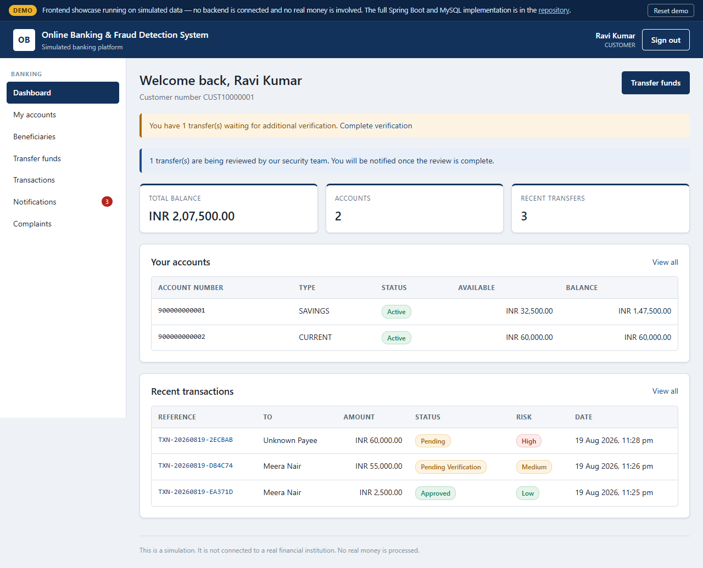
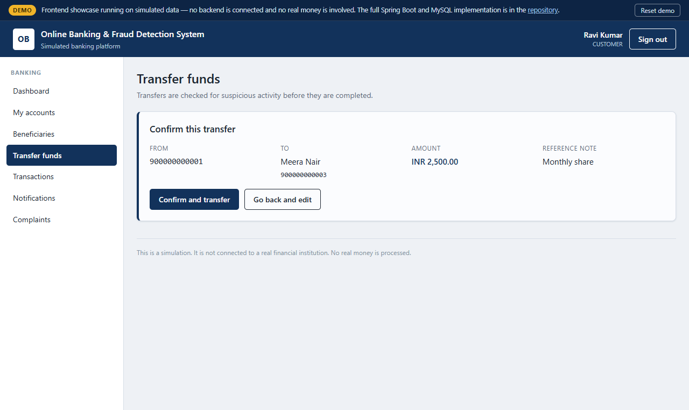
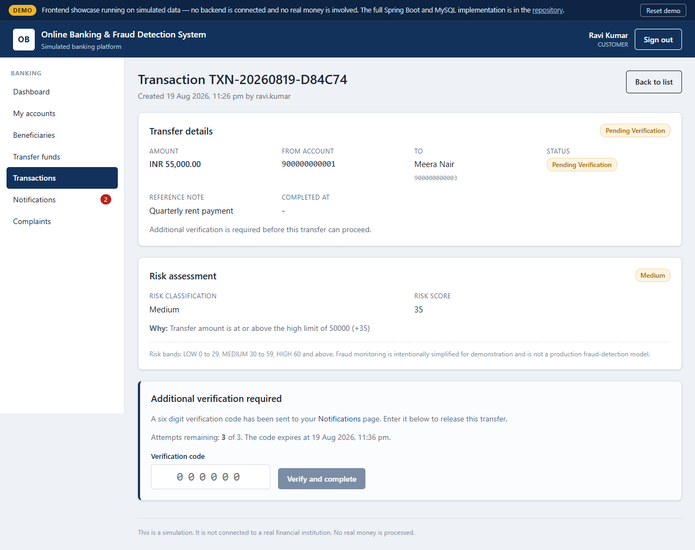
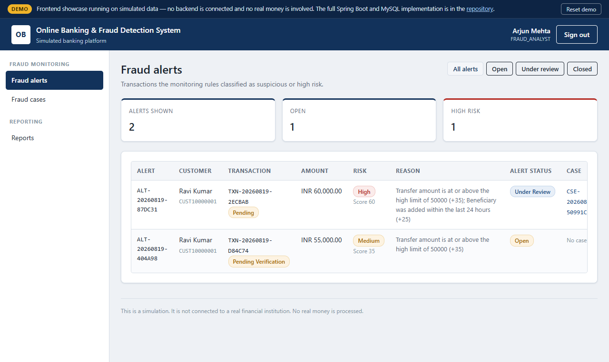
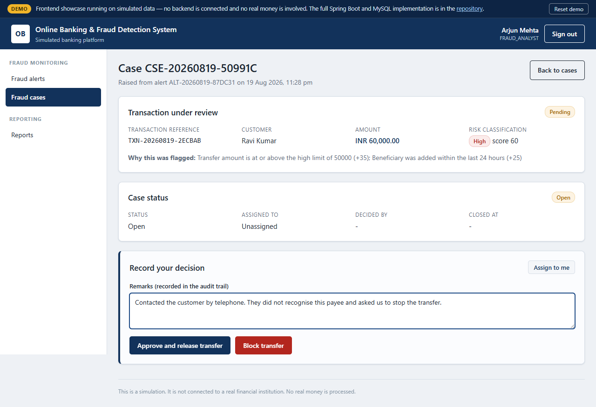
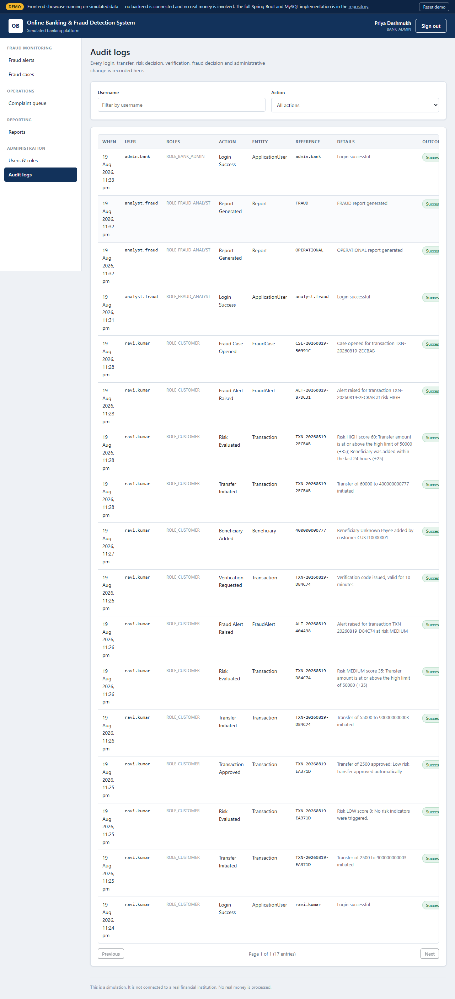
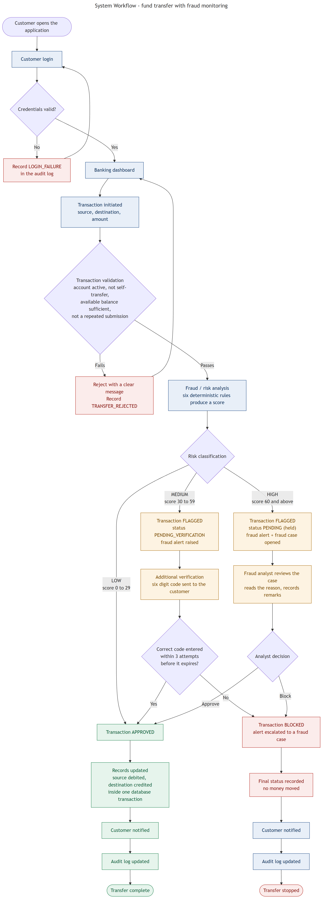

# Online Banking & Fraud Detection System

A full-stack online banking simulation with secure authentication, transaction management,
rule-based fraud-risk analysis, alerts, verification workflows, case review, administration and
audit logging.

[](https://github.com/anmol-228/online-banking-fraud-detection-system/actions/workflows/ci.yml)
[](https://github.com/anmol-228/online-banking-fraud-detection-system/actions/workflows/pages.yml)


### ▶ [Live Demo](https://anmol-228.github.io/online-banking-fraud-detection-system/)

The public demo runs in **frontend showcase mode using simulated data** — everything happens in the
browser, with no backend deployed. This repository also contains the complete Spring Boot backend
and database-backed full-stack implementation for local development.

> **This is a simulation.** It is not connected to any real financial institution and processes no
> real money. All data is fictional.

---

## Overview

Online banking has two problems that pull against each other. Transfers need to be fast and simple,
and they also need to be safe — which means some of them must be stopped and questioned. This
project implements that tension end to end.

Every transfer is scored by a deterministic rule engine **before** it settles. Low-risk transfers
complete immediately. Medium-risk transfers are held until the customer enters a verification code.
High-risk transfers are held until a human analyst decides. Money only ever moves when a transfer
reaches `APPROVED`, and the debit, the credit and the status change happen inside a single database
transaction — so a transfer can never report success while the account update failed.

Every consequential action, including rejected ones, is written to an append-only audit trail.

---

## Key Features

**Customer**
- Registration and login with BCrypt-hashed passwords and stateless JWT sessions
- Account details, balance enquiry with a separate **available balance** that excludes pending transfers
- Beneficiary management (add, view, deactivate)
- Fund transfers with server-side validation, confirmation step and duplicate protection
- Additional verification when a transfer is held for risk
- Transaction history with status and risk classification
- In-app notifications and complaint/dispute submission

**Fraud monitoring**
- Six-rule deterministic risk engine, scored before the transaction is persisted
- Risk classification: **LOW 0–29 · MEDIUM 30–59 · HIGH 60+**
- Automatic fraud alerts with the exact rules that fired, in words
- Six-digit verification challenge (hashed, expiring, attempt-limited)
- Fraud case review: assign, record mandatory remarks, approve or block

**Bank staff**
- Fraud analyst: alert dashboard with filters, case list, case decisions
- Operations officer: complaint queue and outcome recording
- Administrator: user and role management with self-lockout guards
- Audit trail viewer with filtering by user and action
- Operational and fraud reports counted directly from stored data

---

## Screenshots

| Customer dashboard | Fund transfer |
|---|---|
|  |  |

| Transfer held for verification | Fraud analyst alerts |
|---|---|
|  |  |

| Fraud case review | Audit trail |
|---|---|
|  |  |

All screenshots are in [`docs/screenshots/`](docs/screenshots/).

---

## Architecture

```text
React Frontend  (React 19 + Vite, role-filtered navigation)
      ↓  HTTPS / JSON + Bearer token
Spring Boot REST API
      ↓
Authentication & Authorization  (JWT filter, per-endpoint role rules, ownership checks)
      ↓
Service / Domain Layer  (accounts, beneficiaries, transactions, cases, disputes, admin)
      ↓
Fraud Risk Engine  (six deterministic rules → score → LOW / MEDIUM / HIGH)
      ↓
Spring Data JPA
      ↓
MySQL   (H2 in-memory for local dev and tests)

Cross-cutting: notification service, append-only audit logging, centralised error handling
```

A layered **modular monolith** — deliberately not microservices. A transfer that debits one account
and credits another is exactly the case where a single database transaction is the correct answer,
and that is only available inside one service.


More detail: [Architecture](docs/architecture.md) · [Database design](docs/database-design.md) ·
[API](docs/api.md)

---

## Technology Stack

**Frontend** — React 19, Vite 6, React Router 7, Axios, hand-written CSS (no component library)

**Backend** — Java 21 language level, Spring Boot 3.5, Spring Web, Spring Security, Spring Data JPA,
Bean Validation, JJWT

**Database** — MySQL 8 (primary target), H2 in-memory (dev and test profiles)

**Tooling** — Maven, npm, GitHub Actions, JUnit 5, MockMvc, Mockito, AssertJ

---

## Fraud Risk Engine

A **transparent, deterministic, rule-based risk-scoring engine**. Each rule that fires contributes
a fixed number of points; the total maps to a band. The same transfer against the same history
always produces the same score, which is what makes it testable and explainable.

| Rule | Fires when | Points |
|---|---|---|
| Very high amount | amount ≥ 100,000 | 50 |
| High amount | amount ≥ 50,000 | 35 |
| New beneficiary | payee added within 24 hours | 25 |
| Unregistered payee | destination not in the saved payee list | 20 |
| Rapid transfers | ≥ 3 transfers in 10 minutes | 20 |
| Repeated failed verification | ≥ 2 failures in 24 hours | 20 |
| Balance drain | > 80% of the account balance | 15 |
| Unusual hour | between 00:00 and 05:00 | 10 |

| Score | Classification | Outcome |
|---|---|---|
| 0 – 29 | **LOW** | Approved immediately |
| 30 – 59 | **MEDIUM** | Held; customer must enter a verification code |
| 60+ | **HIGH** | Held; fraud analyst decides |

Every threshold is a configuration property and can be tuned without recompiling.

**This is not machine learning and is not marketed as such.** It does not learn from past decisions.
It is a rule engine, and its transparency is the point: the alert, the analyst screen, the customer
screen and the audit entry all state the same reason in the same words.

Detail: [Fraud risk engine](docs/fraud-risk-engine.md)

---

## System Workflow

```text
Login → Authentication → Dashboard → Transfer initiated → Validation → Risk analysis
                                                                            │
        ┌───────────────────────────────┬───────────────────────────────────┘
        │                               │
     LOW risk                     MEDIUM risk                        HIGH risk
        │                               │                                │
   Approved                    Held: verification code            Held: fraud case
   Money moves                        │                                │
   Customer notified          correct → Approved              analyst → Approved
   Audit written              3 failures → Blocked            analyst → Blocked
                                       │                                │
                             Final status recorded → Customer notified → Audit written
```



---

## Project Structure

```text
.
├── backend/                    Spring Boot API
│   └── src/main/java/com/sepro/obfds/
│       ├── config/  controller/  service/  fraud/
│       ├── notification/  audit/  security/
│       └── repository/  entity/  dto/  exception/
├── frontend/                   React + Vite (19 screens)
│   └── src/
│       ├── api/                axios client + endpoint map
│       ├── services/           banking service abstraction (API + showcase adapters)
│       ├── auth/  components/  pages/  utils/
├── docs/                       architecture, database, API, testing, security, deployment
│   ├── diagrams/               11 Mermaid sources + rendered PNGs
│   └── screenshots/
├── scripts/verify_runtime.py   end-to-end verification against a running instance
└── .github/workflows/          CI + GitHub Pages deployment
```

---

## Running Locally

### Prerequisites

JDK 21+ · Maven 3.8+ · Node.js 18+ · npm 9+ · MySQL 8 *(optional — H2 is the default)*

### Backend

```bash
cd backend
mvn spring-boot:run
```

Runs on **http://localhost:8080**. Verify with `curl http://localhost:8080/actuator/health` →
`{"status":"UP"}`.

### Database

No installation needed by default: the `dev` profile uses an in-memory H2 database, seeded with
fictional demo data on every start.

To use MySQL instead:

```sql
CREATE DATABASE obfds CHARACTER SET utf8mb4 COLLATE utf8mb4_unicode_ci;
CREATE USER 'obfds_user'@'localhost' IDENTIFIED BY 'your-password-here';
GRANT ALL PRIVILEGES ON obfds.* TO 'obfds_user'@'localhost';
```

```bash
mvn spring-boot:run -Dspring-boot.run.profiles=mysql
```

Copy `.env.example` to `.env` and set the connection values first. `.env` is git-ignored.

### Frontend

```bash
cd frontend
npm install
npm run dev
```

Runs on **http://localhost:5173** and talks to the backend on 8080.

To build the browser-only showcase locally:

```bash
VITE_APP_MODE=showcase npm run build && npm run preview
```

---

## Demo Accounts

Fictional credentials seeded for local development and the public demo. They grant access to
nothing outside this application.

| Role | Username | Password |
|---|---|---|
| Customer | `ravi.kumar` | `Customer@123` |
| Customer | `meera.nair` | `Customer@123` |
| Bank Administrator | `admin.bank` | `Admin@123` |
| Fraud Analyst | `analyst.fraud` | `Analyst@123` |
| Operations Officer | `ops.officer` | `Officer@123` |
| System Administrator | `sys.admin` | `SysAdmin@123` |

**See the fraud workflow in 60 seconds:** sign in as `ravi.kumar`, transfer **55,000** to Meera Nair
— the transfer is held as MEDIUM risk. Open **Notifications**, read the six-digit code, enter it on
the transaction page, and the transfer completes.

The live demo also has one-click role buttons on the login screen.

---

## API

Full endpoint reference with request/response shapes: **[docs/api.md](docs/api.md)**

All endpoints except `/api/auth/register`, `/api/auth/login` and `/actuator/health` require
`Authorization: Bearer <token>`.

| Group | Purpose |
|---|---|
| `/api/auth` | Registration, login, current profile |
| `/api/accounts` | Account details and balance enquiry |
| `/api/beneficiaries` | Payee management |
| `/api/transactions` | Transfers, history, verification |
| `/api/alerts` · `/api/fraud-cases` | Fraud monitoring and review |
| `/api/notifications` · `/api/disputes` | Customer messaging and complaints |
| `/api/admin` · `/api/audit` · `/api/reports` | Administration, audit trail, reporting |

Every failure returns the same JSON shape with a stable machine-readable `code`.

---

## Testing

```bash
cd backend  && mvn clean package     # compile, run all tests, build the JAR
cd frontend && npm run build         # production build
```

**81 automated tests across 11 classes**, covering unit, integration, security and failure-handling
levels:

| Level | Focus |
|---|---|
| Unit | The fraud rule engine in isolation, with mocked repositories |
| Integration | Controller → security → service → repository → database, via MockMvc |
| Security | Unauthenticated access, forged tokens, wrong-role access, cross-customer isolation |
| Failure handling | Database outage returns 503 with no internal detail leaked |

There is also an end-to-end script that exercises the **running** application over real HTTP:

```bash
python scripts/verify_runtime.py     # expects a freshly started backend
```

Two real defects were found by running the system rather than by the unit tests — a velocity rule
that counted a transfer against itself, and audit entries lost on rejected paths because a
self-invocation bypassed the Spring proxy. Both are fixed and both now have regression tests
written specifically so they *could* fail again. Details: [Testing](docs/testing.md).

---

## Security Considerations

Implemented in this project:

- **Password hashing** — BCrypt; no password is ever stored or logged in readable form
- **Verification codes hashed too** — they grant a financial action, so they are treated like passwords
- **Stateless JWT authentication** with signature and expiry verification on every request
- **Role-based authorization** declared per endpoint, with `anyRequest().authenticated()` as the default, so a new endpoint is protected unless explicitly opened
- **Ownership checks** — every query is scoped to the caller resolved from the security context, never to a client-supplied identifier; a request for another user's resource returns `404` rather than `403` so it does not confirm existence
- **Server-side validation** on every input, independent of the browser
- **Safe error responses** — actionable failures get a specific code, internal faults get a generic message and the detail stays in the server log
- **Restricted CORS** to a configured origin, never a wildcard
- **Audit logging** written in its own transaction so rejected attempts still leave evidence
- **Optimistic locking** on accounts and an idempotency key on transfers

Detail: [Security](docs/security.md)

---

## Limitations

- Fraud detection is a simplified rule engine. **False positives and false negatives are both possible**, and no detection system identifies every fraudulent transaction.
- No real banking integration and no real-money processing. All data is fictional.
- The public demo is frontend-only and uses simulated data held in the browser.
- The backend and database are **not** publicly deployed yet.
- JWTs cannot be revoked before expiry, so disabling a login prevents the next sign-in but does not invalidate a token already issued.
- Schema is managed by Hibernate `ddl-auto` rather than versioned migrations.
- Concurrency control is implemented but not load-tested; horizontal scaling is a design property, not a demonstrated one.
- Production deployment would require security assessment, load testing and operational hardening that have not been performed.

---

## Future Improvements

- Full-stack cloud deployment — see the [deployment roadmap](docs/full-stack-deployment-roadmap.md)
- Database migrations with Flyway instead of `ddl-auto`
- Token revocation so disabling a login takes effect immediately
- A genuine out-of-band channel (SMS/email) for verification codes
- Containerised deployment and a richer CI/CD pipeline
- Concurrency tests that drive simultaneous transfers on one account
- Deeper reporting and analytics over the audit trail

---

## License

No license has been chosen for this repository yet, so default copyright applies. If you would like
to use any part of it, please open an issue.
