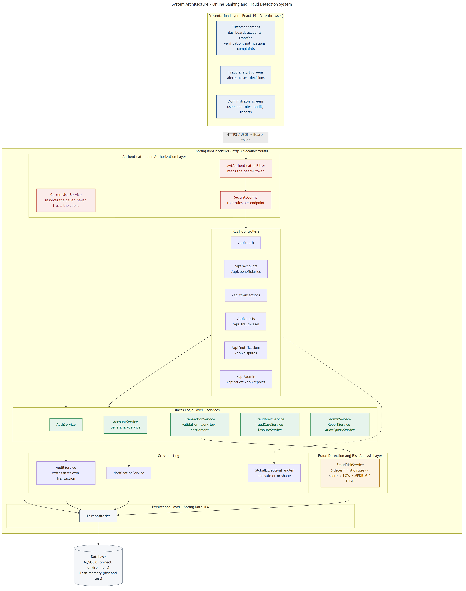
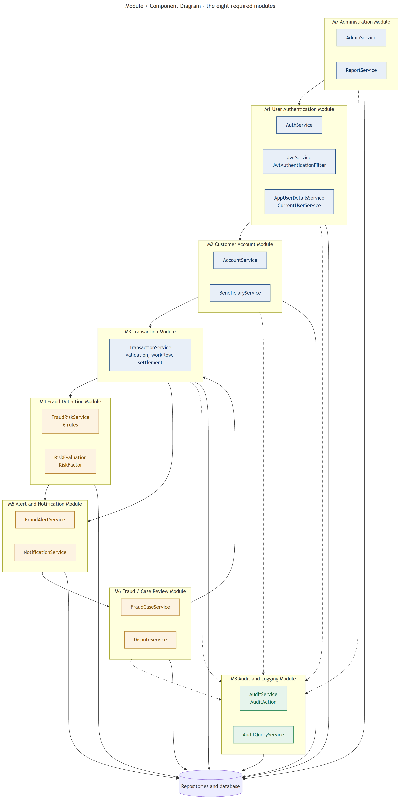
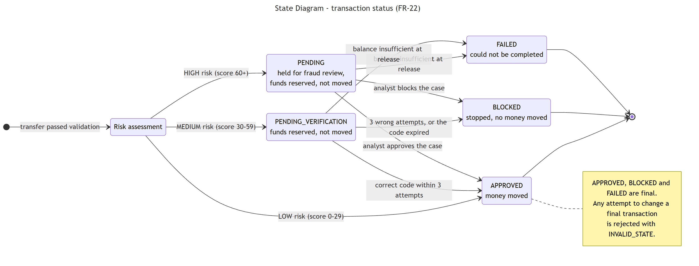
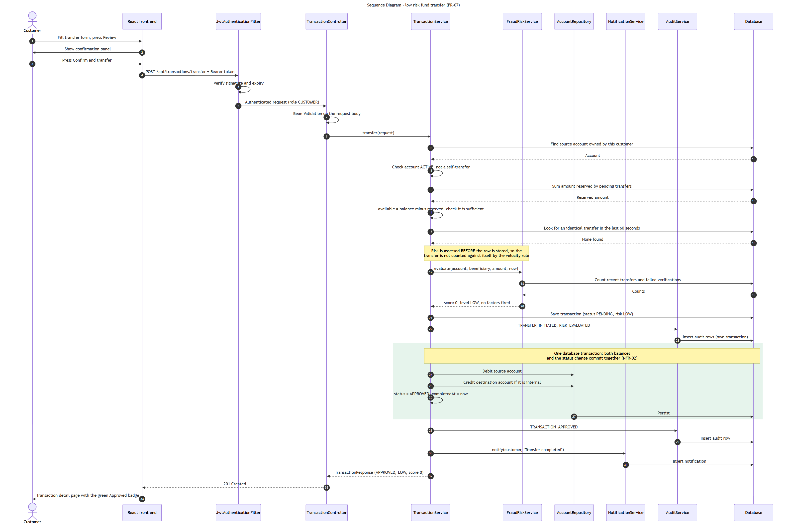
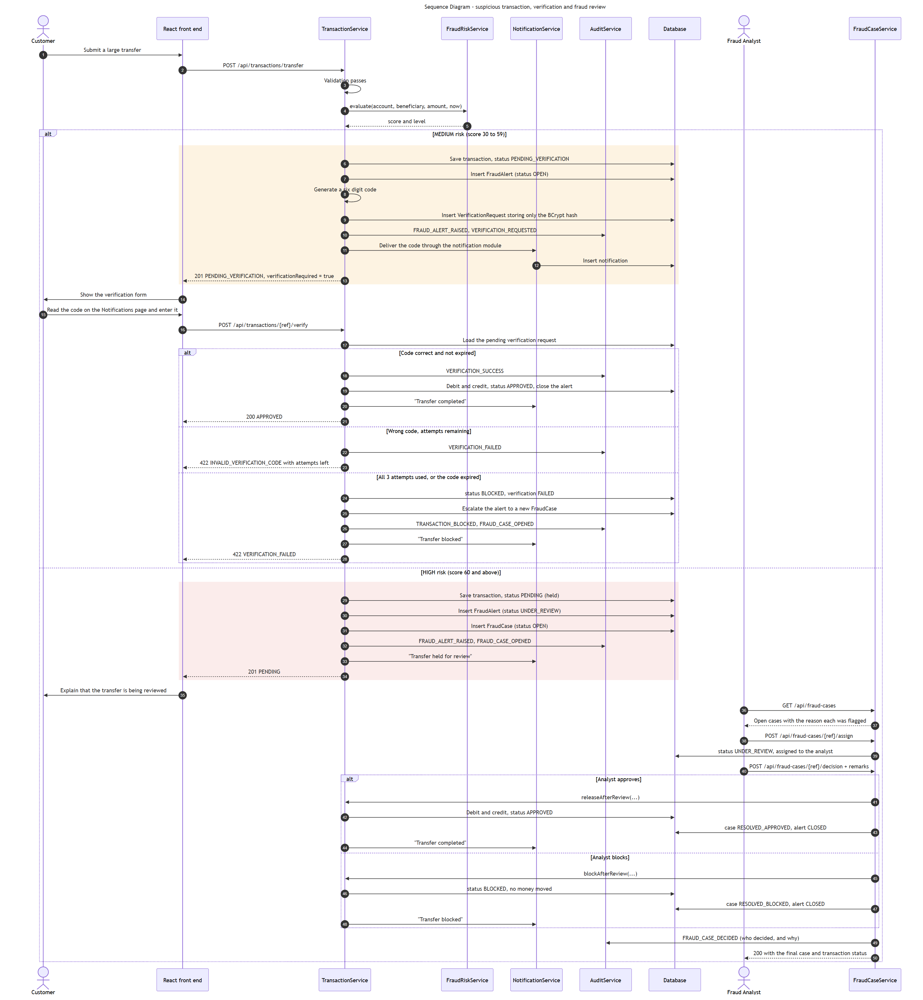

# Architecture

A layered modular monolith: one deployable backend, internally divided into layers with a
one-directional dependency rule — a layer may call the layer below it and never the one above.



---

## 1. Layers

```text
Presentation            React 19 + Vite, role-filtered navigation
        ↓
Authentication          JWT filter, per-endpoint role rules, caller resolution
        ↓
Business logic          accounts, beneficiaries, transactions, cases, disputes, admin
        ↓
Fraud risk analysis     six deterministic rules → score → LOW / MEDIUM / HIGH
        ↓
Persistence             Spring Data JPA → MySQL / H2
```

Notification, audit logging and error handling are cross-cutting services used by the business
layer.

### Why a monolith

At this scale a microservice split would add network calls, distributed transactions and deployment
machinery without demonstrating anything additional. A transfer that debits one account and credits
another is exactly the case where a single database transaction is the right answer, and that is
only available inside one service.

---

## 2. Backend package structure

```text
com.sepro.obfds
├── config/          AppProperties, SecurityConfig, DataSeeder
├── controller/      11 REST controllers, one per endpoint group
├── service/         business logic
├── fraud/           FraudRiskService, RiskEvaluation, RiskFactor
├── notification/    NotificationService
├── audit/           AuditService, AuditAction
├── security/        JwtService, JwtAuthenticationFilter, CurrentUserService
├── repository/      12 Spring Data JPA repositories
├── entity/          12 entities + 11 enums
├── dto/             27 request and response records
└── exception/       ApiException hierarchy, ApiError, GlobalExceptionHandler
```

---

## 3. Modules

| Module | Classes | Responsibility |
|---|---|---|
| Authentication | `AuthService`, `JwtService`, `JwtAuthenticationFilter`, `CurrentUserService` | Registration, login, token issue and verification, role authorities |
| Customer account | `AccountService`, `BeneficiaryService` | Accounts, balances, available balance, payees |
| Transaction | `TransactionService` | Validation, workflow orchestration, settlement, history |
| Fraud detection | `FraudRiskService` | Deterministic rule engine producing a score and classification |
| Alert & notification | `FraudAlertService`, `NotificationService` | Fraud alerts, customer messages, verification code delivery |
| Fraud/case review | `FraudCaseService`, `DisputeService` | Case decisions, complaints and outcomes |
| Administration | `AdminService`, `ReportService` | Users, roles, login status, reports |
| Audit & logging | `AuditService`, `AuditQueryService` | Append-only record of every important event |



### Dependency direction

`FraudCaseService` depends on `TransactionService`, never the reverse. An analyst decision must be
able to settle a held transfer, so the review module calls the transaction module; the transaction
module knows nothing about cases. The dependency graph stays acyclic, and settlement logic lives in
exactly one place whether it is reached by a low-risk transfer, a successful verification or an
analyst approval.

---

## 4. Security architecture

### Authentication

Stateless JWT. On login the backend verifies the password against its BCrypt hash and issues a
token carrying the username, granted authorities and an expiry. Every later request presents
`Authorization: Bearer <token>`; the filter verifies signature and expiry and populates the
security context. An invalid token is an expected condition — the request stays unauthenticated and
the entry point returns 401 with a JSON body.

No server-side session means a second application instance needs no session replication.

### Authorization

Every endpoint group carries an explicit role rule, and the chain ends with
`anyRequest().authenticated()` — so a newly added endpoint is protected by default rather than
accidentally public.

| Path | Roles |
|---|---|
| `/api/auth/register`, `/api/auth/login`, `/actuator/health` | public |
| `/api/accounts/**`, `/api/beneficiaries/**`, `/api/transactions/**`, `/api/notifications/**` | `CUSTOMER` |
| `/api/disputes/queue`, `/api/disputes/*/resolve` | `OPS_OFFICER`, `BANK_ADMIN` |
| `/api/disputes/**` | `CUSTOMER` |
| `/api/alerts/**`, `/api/fraud-cases/**` | `FRAUD_ANALYST`, `BANK_ADMIN` |
| `/api/admin/**` | `BANK_ADMIN` |
| `/api/audit/**` | `BANK_ADMIN`, `SYSTEM_ADMIN` |
| `/api/reports/**` | `BANK_ADMIN`, `FRAUD_ANALYST`, `OPS_OFFICER` |

Rule order matters: the two staff dispute paths are declared before the customer catch-all, since
the first matching rule wins.

### Ownership

Role alone is not sufficient — every customer holds `CUSTOMER`. Services resolve the caller through
`CurrentUserService` and scope every query to that customer. A request for another customer's
resource answers **404, not 403**, so the response does not confirm that the resource exists.

---

## 5. Transaction workflow



### Status model

`PENDING` · `PENDING_VERIFICATION` · `APPROVED` · `BLOCKED` · `FAILED`

`APPROVED`, `BLOCKED` and `FAILED` are final; any attempt to change a final transaction is rejected
with `INVALID_STATE`.

### Fund reservation

Money moves only at `APPROVED`. While a transfer is `PENDING` or `PENDING_VERIFICATION` its amount
is **reserved**:

```text
available balance = balance − Σ(amount of transfers in PENDING or PENDING_VERIFICATION)
```

Validation uses the available balance. Without this a customer could start two large transfers that
each pass the balance check individually but together exceed the balance.

### Atomic settlement

The debit, the credit and the status change happen inside one `@Transactional` method, so either
all three are stored or none are. A defensive re-check demotes a released transfer to `FAILED` if
the balance is no longer sufficient, rather than settling it incorrectly.

### Duplicate protection

Two independent mechanisms:

1. **Idempotency key** — generated once per form submission and unique in the database. A repeat
   returns the original transaction instead of creating a second one.
2. **Duplicate window** — identical source, destination and amount within 60 seconds is rejected
   with `409 DUPLICATE_TRANSACTION`.





---

## 6. Error handling

One `@RestControllerAdvice` produces a single error shape for the whole API. The governing rule:
anything the caller can act on gets a specific code and message; anything caused by an internal
fault gets a generic message while the real detail goes to the server log only.

```json
{
  "timestamp": "2026-08-19T03:02:34Z",
  "status": 422,
  "code": "INSUFFICIENT_BALANCE",
  "message": "The available balance in this account is not sufficient for this transfer.",
  "path": "/api/transactions/transfer",
  "fieldErrors": {}
}
```

---

## 7. Audit design

Audit rows are **append-only** — nothing in the application updates or deletes them.

Writes use `Propagation.REQUIRES_NEW` so an entry survives even when the surrounding operation is
being rejected: a failed login must leave evidence. The annotation sits on the public entry points
rather than only on the internal write method, because a call from one method of a class to another
in the same class does not pass through the Spring proxy — a subtlety that caused a real defect
during development.

Action names come from a fixed vocabulary in `AuditAction`, so the same event cannot be recorded
under three spellings and the audit filter stays usable.

---

## 8. Frontend architecture

| Concern | Approach |
|---|---|
| Routing | React Router; `ProtectedRoute` checks authentication and role |
| State | React context for the session, local state per page — no global store at this size |
| Data access | A single `bankingService` abstraction with two interchangeable implementations |
| Errors | `readError()` turns any failure into one readable sentence; field errors appear beside the field |
| Status colours | One `Badge` component owns the value-to-colour mapping, so `APPROVED` is the same green everywhere |
| Navigation | Filtered by role — a customer never sees analyst or administrator items |
| Safety | Confirmation before transferring, removing a payee, deciding a case or disabling a login |

Hiding a menu item is a usability measure, not a security measure — every endpoint is independently
protected on the server.

### Dual-mode data access

```text
bankingService
   ├── apiBankingService       → Spring Boot backend  (full-stack mode, default)
   └── showcaseBankingService  → in-browser simulation (public demo build)
```

The choice is made once, from the build-time `VITE_APP_MODE`. No screen contains a conditional for
it, which is what keeps the two modes from drifting apart. The showcase implementation mirrors the
backend's validation rules, fraud scoring, transaction states and audit behaviour.
