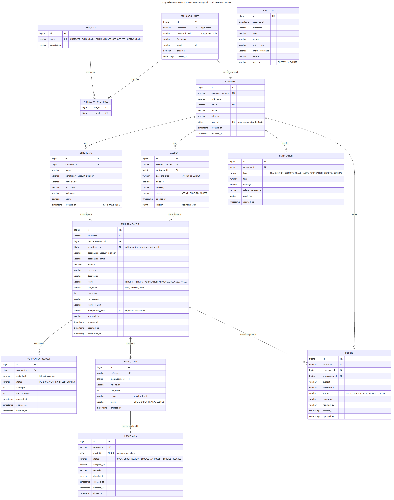

# Database Design



---

## 1. Entities

Twelve entities plus one join table.

| Table | Purpose |
|---|---|
| `application_user` | Login identity: username, BCrypt hash, enabled flag |
| `user_role` | A grantable role, stored as a row so it can be changed at run time |
| `application_user_role` | Many-to-many join |
| `customer` | Banking identity of a customer |
| `account` | A simulated bank account |
| `beneficiary` | A saved payee |
| `bank_transaction` | A fund transfer |
| `verification_request` | An additional-verification challenge |
| `fraud_alert` | Alert raised for a suspicious transfer |
| `fraud_case` | Investigation opened from an alert |
| `dispute` | Customer complaint about a transaction |
| `notification` | Message to a customer |
| `audit_log` | Append-only record of important events |

`Transaction` maps to `bank_transaction` because `TRANSACTION` is a reserved word in MySQL and
several other dialects. `Notification.read` maps to `read_flag` for the same reason.

---

## 2. Relationships

```text
ApplicationUser  *---*    UserRole            (via application_user_role)
ApplicationUser  1---0..1 Customer            (staff log in but own no accounts)
Customer         1---*    Account
Customer         1---*    Beneficiary
Customer         1---*    Notification
Customer         1---*    Dispute
Account          1---*    Transaction         (as the source account)
Beneficiary      0..1---* Transaction         (null when the payee was not saved)
Transaction      1---0..* FraudAlert
Transaction      1---0..* VerificationRequest
Transaction      1---0..* Dispute
FraudAlert       1---0..1 FraudCase
```

`audit_log` has **no foreign keys** by design. Audit rows record what happened, including events
involving records that may later be deactivated or that never existed — a login attempt with an
unknown username, for example. Linking by `username` and `entity_reference` as plain values keeps
the trail complete and independent, which is the whole point of an audit trail.

---

## 3. Three design decisions

### Login identity is separate from banking identity

Bank staff — administrators, fraud analysts, operations officers — must log in but do not own bank
accounts. Merging login and banking identity into one table would mean every staff member carried a
row in a table called `customer`, with `customer_number` either null or meaningless, and
`account.customer_id` would point at a table that no longer means "customer".

Separating them gives a clean one-to-one that is simply absent for staff, a foreign key from
`account` to a table where every row genuinely is a customer, and one place where authentication
concerns live.

### Verification challenges are their own entity

A challenge has state that does not belong on the transaction row: a hashed code, an attempt
counter, a maximum, an expiry and its own status. Keeping past requests also enables the
`REPEATED_FAILED_VERIFICATION` rule, which counts failures **across** transfers.

Only a BCrypt hash of the code is stored, exactly like a password.

### Disputes are their own entity

A complaint has its own lifecycle (`OPEN → UNDER_REVIEW → RESOLVED | REJECTED`), its own text, its
own resolution and its own handler. Putting those on `bank_transaction` would mix two unrelated
concerns and make it impossible to distinguish "this transfer was blocked" from "this transfer is
disputed".

---

## 4. Key table definitions

### `account`

| Column | Type | Constraints |
|---|---|---|
| `id` | BIGINT | PK |
| `account_number` | VARCHAR(20) | NOT NULL, UNIQUE |
| `customer_id` | BIGINT | NOT NULL, FK → `customer.id` |
| `account_type` | VARCHAR(20) | `SAVINGS` or `CURRENT` |
| `balance` | DECIMAL(15,2) | NOT NULL |
| `currency` | VARCHAR(3) | NOT NULL |
| `status` | VARCHAR(20) | `ACTIVE`, `BLOCKED`, `CLOSED` |
| `opened_at` | TIMESTAMP | NOT NULL |
| `version` | BIGINT | NOT NULL — optimistic lock |

`DECIMAL(15,2)` rather than a floating-point type: binary floating point cannot represent decimal
money exactly, and the errors accumulate. `BigDecimal` is used throughout the Java side.

### `bank_transaction`

| Column | Type | Notes |
|---|---|---|
| `id` | BIGINT | PK |
| `reference` | VARCHAR(30) | UNIQUE — e.g. `TXN-20260819-726BBC` |
| `source_account_id` | BIGINT | FK → `account.id` |
| `beneficiary_id` | BIGINT | FK, nullable when the payee was not saved |
| `destination_account_number` | VARCHAR(20) | |
| `destination_name` | VARCHAR(120) | |
| `amount` | DECIMAL(15,2) | |
| `status` | VARCHAR(30) | `PENDING`, `PENDING_VERIFICATION`, `APPROVED`, `BLOCKED`, `FAILED` |
| `risk_level` | VARCHAR(10) | `LOW`, `MEDIUM`, `HIGH` |
| `risk_score` | INT | |
| `risk_reason` | VARCHAR(500) | Which rules fired, in words |
| `status_reason` | VARCHAR(250) | Why the status is what it is |
| `idempotency_key` | VARCHAR(80) | UNIQUE, nullable |
| `initiated_by` | VARCHAR(60) | |
| `created_at` / `updated_at` / `completed_at` | TIMESTAMP | |

Indexes on `source_account_id`, `status` and `created_at` — the three columns the history query,
the reserved-amount sum and the velocity rule filter on.

### `audit_log`

| Column | Type | Notes |
|---|---|---|
| `id` | BIGINT | PK |
| `occurred_at` | TIMESTAMP | Indexed |
| `username` | VARCHAR(60) | Indexed |
| `roles` | VARCHAR(120) | Authorities held at the time |
| `action` | VARCHAR(60) | Indexed, from a fixed vocabulary |
| `entity_type` / `entity_reference` | VARCHAR | |
| `details` | VARCHAR(500) | Truncated safely if longer |
| `outcome` | VARCHAR(10) | `SUCCESS` or `FAILURE` |

---

## 5. Data integrity

| Concern | Mechanism |
|---|---|
| Referential integrity | Foreign keys on every relationship |
| No duplicate logins, emails, account numbers, references | Unique constraints |
| No duplicate payee for one customer | Composite unique on (`customer_id`, `beneficiary_account_number`) |
| One fraud case per alert | Unique constraint on `fraud_case.alert_id` |
| No duplicate transfer | Unique `idempotency_key` plus a 60-second duplicate window |
| Concurrent balance updates | `@Version` optimistic locking; a losing update is rejected with 409 rather than silently overwriting |
| Atomic settlement | Debit, credit and status change inside one `@Transactional` method |
| Over-commitment of funds | Available balance excludes amounts reserved by pending transfers |
| Invalid state transitions | `APPROVED`, `BLOCKED`, `FAILED` are final; further changes rejected |
| Monetary precision | `DECIMAL(15,2)` and `BigDecimal`, never floating point |
| History stays readable | Beneficiaries are deactivated, never deleted |
| Audit immutability | Audit rows are only ever inserted and read |

---

## 6. Schema management

| Profile | Database | `ddl-auto` | Use |
|---|---|---|---|
| `dev` | H2 in-memory | `create-drop` | Local development; fresh seeded dataset every start |
| `test` | H2 in-memory, isolated | `create-drop` | Automated tests |
| `mysql` | MySQL 8 | `update` | Primary target environment |

`update` is a pragmatic choice for a project at this stage. A production deployment would use
Flyway or Liquibase so that every schema change is versioned, reviewed and reversible — see the
[deployment roadmap](full-stack-deployment-roadmap.md).

---

## 7. Seed data

`DataSeeder` creates the five roles in every environment, and a fictional demo dataset when
`obfds.seed-demo-data` is true **and** no users exist yet. The skip condition means restarting
against MySQL does not duplicate data.

Seeded: 6 users (2 customers, 4 staff), 2 customers, 3 accounts, 3 beneficiaries.

Beneficiaries are backdated 30 days so they do **not** trigger the new-beneficiary rule — which is
what makes a payee added live during a demonstration trigger it visibly.

All names, account numbers and email addresses are invented. Email addresses use the reserved
`.example` top-level domain, which can never resolve to a real address.
