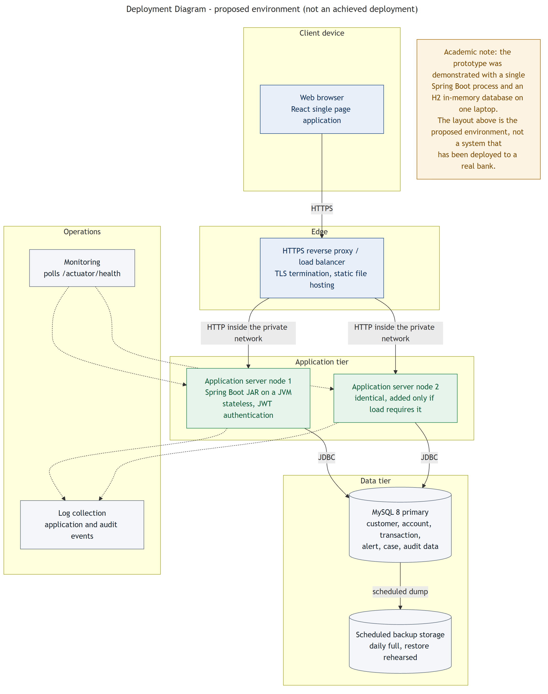

# Deployment

## Current state

| What | Where | Status |
|---|---|---|
| Frontend showcase | GitHub Pages | **Live** — [demo](https://anmol-228.github.io/online-banking-fraud-detection-system/) |
| Spring Boot backend | — | Source published, **not deployed** |
| MySQL database | — | Schema and seed logic published, **not deployed** |

The public demo is a **frontend-only build using simulated data**. The backend and database are
intentionally not yet deployed; see the [full-stack deployment roadmap](full-stack-deployment-roadmap.md).

---

## Build modes

The frontend has two build modes, chosen at build time by `VITE_APP_MODE`:

| Mode | Data source | Used for |
|---|---|---|
| `api` (default) | Spring Boot backend over HTTP | Local development, full-stack deployment |
| `showcase` | In-browser simulation | The public GitHub Pages demo |

Both share the same screens and the same service contract. The choice is made once in
`services/bankingService.js`; no screen contains a conditional for it.

### Showcase specifics

- **Router:** a hash router, so every route works on direct visit and refresh without server
  rewrite rules. A `404.html` fallback catches any plain sub-path and redirects into the app.
- **Base path:** `VITE_BASE_PATH` is set to the repository sub-path by the Pages workflow, and
  defaults to `/` locally.
- **State:** held in memory and mirrored to `localStorage` so a refresh does not lose progress. A
  "Reset demo" control clears it. Nothing is sent anywhere.
- **Disclosure:** a persistent banner states that the data is simulated and no backend is
  connected.

Building it locally:

```bash
cd frontend
VITE_APP_MODE=showcase npm run build
npm run preview
```

---

## Spring Boot profiles

| Profile | Database | Schema | Purpose |
|---|---|---|---|
| `dev` | H2 in-memory | `create-drop` | Local development; fresh seeded data every start |
| `test` | H2 in-memory, isolated | `create-drop` | Automated tests |
| `mysql` | MySQL 8 | `update` | Primary target environment |

```bash
mvn spring-boot:run                                    # dev
mvn spring-boot:run -Dspring-boot.run.profiles=mysql   # MySQL
```

---

## Configuration

Nothing secret is committed. `.env.example` is the template; `.env` is git-ignored.

| Variable | Purpose |
|---|---|
| `SPRING_PROFILES_ACTIVE` | `dev` or `mysql` |
| `SERVER_PORT` | Backend port (default 8080) |
| `OBFDS_JWT_SECRET` | Token signing key — **at least 32 characters**, validated at start-up |
| `OBFDS_JWT_EXPIRY_MINUTES` | Token lifetime (default 120) |
| `OBFDS_CORS_ALLOWED_ORIGINS` | Exact browser origin permitted; never a wildcard |
| `OBFDS_SEED_DEMO_DATA` | Whether to seed the fictional dataset |
| `MYSQL_URL` / `MYSQL_USERNAME` / `MYSQL_PASSWORD` | MySQL profile only |
| `OBFDS_FRAUD_*` | Fraud thresholds, tunable without a rebuild |
| `VITE_API_BASE_URL` | Backend URL used by the frontend (build time) |
| `VITE_APP_MODE` | `api` or `showcase` (build time) |
| `VITE_BASE_PATH` | Public base path for the built site (build time) |

Values baked into a frontend build are **public**. No private credential is ever passed through a
`VITE_` variable.

---

## Continuous integration

`.github/workflows/ci.yml` runs on pushes and pull requests to `main`:

- **Backend** — JDK 21, cached Maven dependencies, `mvn clean verify` (compiles and runs all 81 tests)
- **Frontend** — Node 20, `npm ci` for a reproducible install, `npm run build`

`.github/workflows/pages.yml` builds the showcase and deploys it to GitHub Pages using the official
Actions-based publishing source. It uploads only the static frontend artifact — no JAR, no
database, no server process.

---

## Proposed full-stack topology

Not yet built. Documented so the intent is clear:

```text
Browser  ──HTTPS──▶  Reverse proxy / load balancer
                       │  (TLS termination, serves the built React files)
                       ▼
              One or more stateless Spring Boot instances
                       │  (JDBC, private network)
                       ▼
              MySQL 8  ──scheduled backup──▶  Backup storage
```

Because authentication is a stateless JWT with no server-side session, a second application
instance requires no session replication or sticky sessions.



### Operational concerns

| Concern | Approach |
|---|---|
| Transport | HTTPS at the proxy; plain HTTP only inside the private network |
| Health | `/actuator/health` is public for monitoring; metrics, env and bean endpoints are not exposed |
| Application logs | INFO level; internal error detail stays server-side |
| Audit | Stored in the database as business evidence, separate from diagnostics |
| Backup | Scheduled dump to separate storage — **and a rehearsed restore**, because a backup that has never been restored is an assumption |
| Recovery | Restore the database, restart the stateless application, verify health and one login |

### Deployment steps (proposed)

1. Provision the database host; create the schema and a dedicated application account with rights
   on that schema only.
2. Set every environment variable, including a freshly generated `OBFDS_JWT_SECRET` and
   `OBFDS_SEED_DEMO_DATA=false`.
3. `mvn clean package` → deploy the JAR with `SPRING_PROFILES_ACTIVE=mysql`.
4. Build the frontend with `VITE_API_BASE_URL` pointing at the deployed API.
5. Serve the built files behind the reverse proxy; configure TLS and the exact CORS origin.
6. Verify: health returns UP, one login succeeds, one transfer completes, the audit trail contains
   the corresponding entries.
7. Enable scheduled backups and perform one restore rehearsal.

---

## Known deployment limitations

| Limitation | What a production deployment would do |
|---|---|
| Schema managed by Hibernate `ddl-auto` | Flyway or Liquibase, so every change is versioned and reversible |
| No containerisation | A multi-stage Dockerfile and a compose file |
| Tokens cannot be revoked before expiry | Short-lived access tokens with refresh, or a revocation list |
| Single database instance | A replica and a documented failover procedure |
| Verification codes delivered in-app | A real SMS or email provider, so the second factor is genuinely out of band |
| No rate limiting | Throttling at the proxy or application layer |
